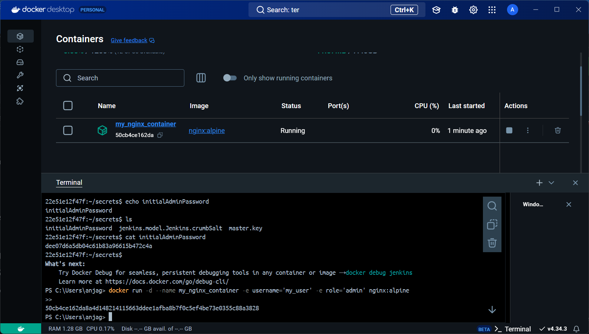
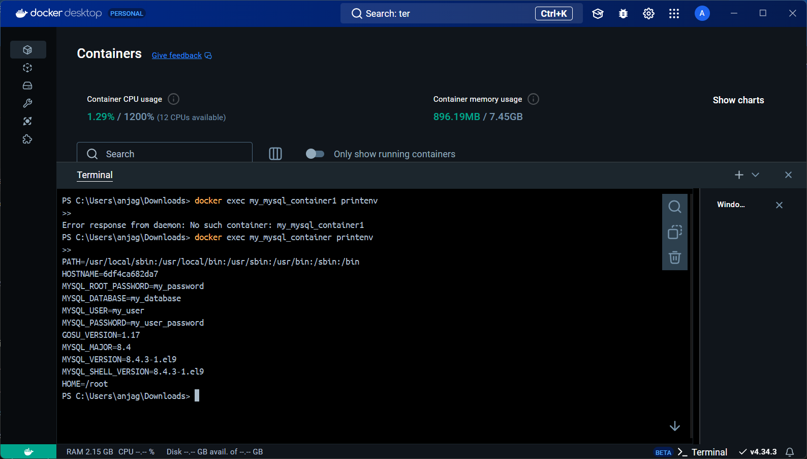

# Variables de Entorno
### ¿Qué son las variables de entorno
Las variables de entorno son valores dinámicos que pueden afectar el comportamiento de los procesos en ejecución en un sistema operativo. Estas variables proporcionan información importante sobre el entorno del sistema y se utilizan para configurar el comportamiento de aplicaciones, scripts o procesos. Se definen como pares clave-valor y se utilizan para almacenar información como rutas de archivos, credenciales, configuraciones de red, entre otros.

Por ejemplo, en sistemas basados en Unix o Linux, una variable de entorno como PATH especifica las rutas en las que el sistema buscará ejecutables cuando se introduce un comando en la terminal.  

### Para crear un contenedor con variables de entorno?

```
docker run -d --name <nombre contenedor> -e <nombre variable1>=<valor1> -e <nombre variable2>=<valor2>
```

### Crear un contenedor a partir de la imagen de nginx:alpine con las siguientes variables de entorno: username y role. Para la variable de entorno rol asignar el valor admin.

```
docker run -d --name my_nginx_container -e username='my_user' -e role='admin' nginx:alpine
```



### Crear un contenedor con mysql:8 , mapear todos los puertos
```
docker run -d --name my_mysql_container -e MYSQL_ROOT_PASSWORD=my_password -P mysql:8
```

### ¿El contenedor se está ejecutando?
Si , lo podemos verificar con el comando: ```docker ps```

### Identificar el problema
En este caso no existe ningun error al ejecuta , pero si existiera alguno se puede usar el comando: ```docker logs my_mysql_container```

### Eliminar el contenedor creado con mysql:8 
1. Detener el contenedor (si está en ejecución):
```docker stop my_mysql_container```
2. Eliminar el contenedor:
```docker rm my_mysql_container```

### Para crear un contenedor con variables de entorno especificadas
- Portabilidad: Las aplicaciones se vuelven más portátiles y pueden ser desplegadas en diferentes entornos (desarrollo, pruebas, producción) simplemente cambiando el archivo de variables de entorno.
- Centralización: Todas las configuraciones importantes se centralizan en un solo lugar, lo que facilita la gestión y auditoría de las configuraciones.
- Consistencia: Asegura que todos los miembros del equipo de desarrollo o los entornos de despliegue utilicen las mismas configuraciones.
- Evitar Exposición en el Código: Mantener variables sensibles como contraseñas, claves API, y tokens fuera del código fuente reduce el riesgo de exposición accidental a través del control de versiones.
- Control de Acceso: Los archivos de variables de entorno pueden ser gestionados con permisos específicos, limitando quién puede ver o modificar la configuración sensible.

Previo a esto es necesario crear el archivo y colocar las variables en un archivo, **.env** se ha convertido en una convención estándar, pero también es posible usar cualquier extensión como **.txt**.
```
docker run -d --name <nombre contenedor> --env-file=<nombreArchivo>.<extensión> <nombre imagen>
```
**Considerar**
Es necesario especificar la ruta absoluta del archivo si este se encuentra en una ubicación diferente a la que estás ejecutando el comando docker run.

### Crear un contenedor con mysql:8 , mapear todos los puertos y configurar las variables de entorno mediante un archivo
Estas son las variables de entorno que le proporcione a mi contenedor
```
MYSQL_ROOT_PASSWORD=my_password
MYSQL_DATABASE=my_database
MYSQL_USER=my_user
MYSQL_PASSWORD=my_user_password
```
Posteriormente ejecute este codigo
```
docker run -d --name my_mysql_container --env-file=./mysql.env -P mysql:8
```



### ¿Qué bases de datos existen en el contenedor creado?
Use el siguiente codigo para poder acceder a la consola de la base de datos
```
docker exec -it my_mysql_container mysql -u root -p
```
Luego use el comando para poder ver las bases de datos que estan en el contenedor
```
SHOW DATABASES;
```
